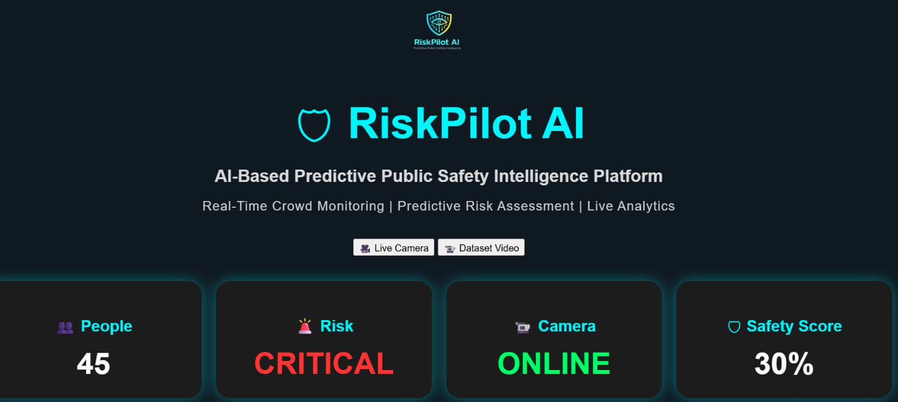
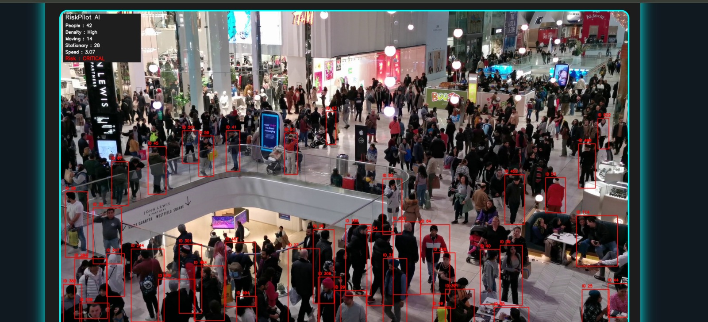
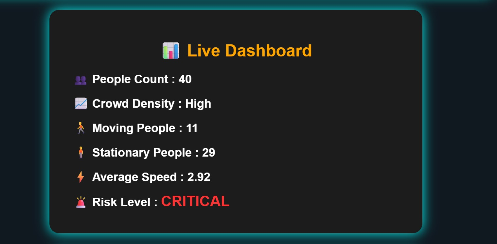
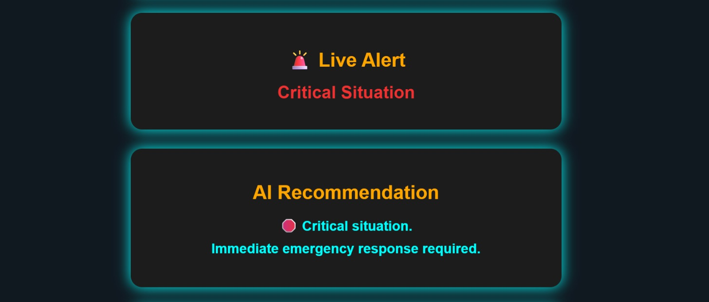
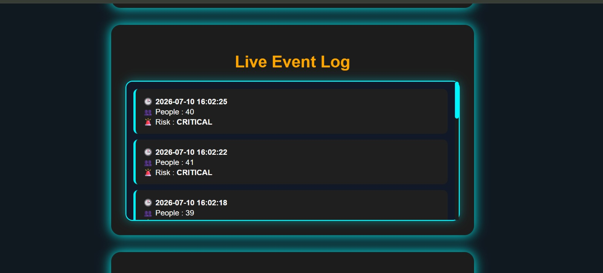
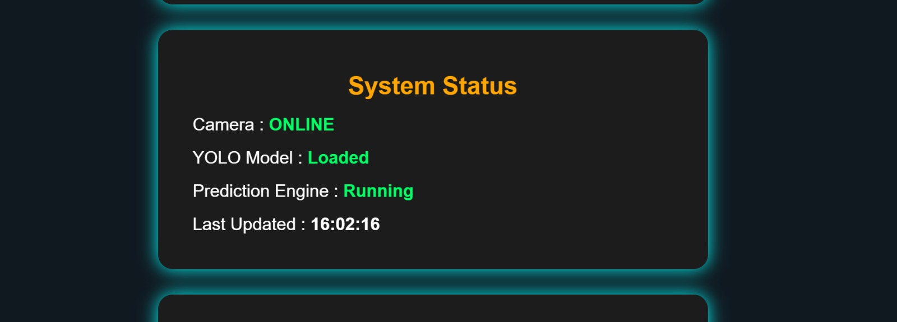
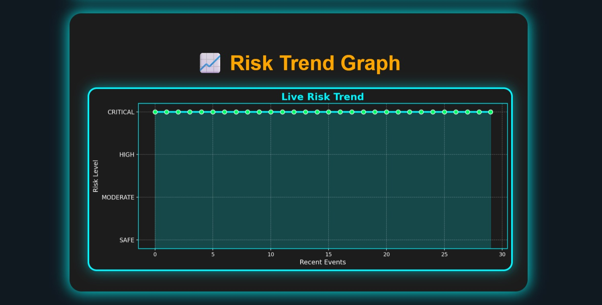

# RiskPilot AI

A real-time crowd monitoring and risk prediction system developed using **YOLOv8**, **ByteTrack**, **Random Forest**, and **Flask**.

---

## Overview

RiskPilot AI is a computer vision project developed to monitor crowd activity and estimate the risk level in public places. The system detects people in real time, tracks their movement, analyzes crowd density, and predicts the overall crowd risk using a **Random Forest classification model**.

The application supports both **live webcam monitoring** and **dataset video analysis** through an interactive Flask web dashboard.

---

## Objectives

The main objectives of this project are:

- Develop a real-time crowd monitoring system using computer vision.
- Detect and count people accurately using YOLOv8.
- Track people across video frames using ByteTrack.
- Analyze crowd density, movement, and average movement speed.
- Predict crowd risk using a Random Forest classification model.
- Display live analytics through a Flask web dashboard.
- Generate alerts and maintain an event log.
- Support both live camera and prerecorded video analysis.
- Build a scalable foundation for future public safety and surveillance applications.

---

## Features

- Real-time person detection using YOLOv8
- Person tracking using ByteTrack
- Crowd density estimation
- Moving and stationary people analysis
- Average crowd movement speed calculation
- Risk prediction using a Random Forest model
- Live dashboard with crowd analytics
- Event logging with timestamps
- Risk trend visualization
- Live webcam mode
- Dataset video mode
- Safety recommendations based on the predicted risk level

---

## Technologies Used

### Programming Language

- Python

### Backend

- Flask

### Computer Vision

- OpenCV
- YOLOv8 (Ultralytics)
- ByteTrack

### Machine Learning

- Random Forest Classifier (Scikit-learn)

### Data Processing

- Pandas
- NumPy

### Frontend

- HTML
- CSS
- JavaScript

---

## Project Structure

```text
RiskPilot/
│
├── assets/
├── models/
├── src/
├── static/
├── templates/
├── requirements.txt
└── README.md
```

---

## How It Works

1. Capture video from a webcam or dataset video.
2. Detect people using YOLOv8.
3. Track detected people using ByteTrack.
4. Extract crowd information:
   - People Count
   - Crowd Density
   - Moving People
   - Stationary People
   - Average Speed
5. Predict the crowd risk level using the trained Random Forest model.
6. Display live analytics on the Flask dashboard.
7. Store detected events and display safety recommendations based on the predicted risk level.

---

## Screenshots

### Home Page



---

### Live Camera Mode



---

### Dashboard



---

### Critical Risk Alert



---

### Event Log



---

### System Status



---

### Risk Trend Graph



---

## Risk Levels

| Risk Level | Description |
|------------|-------------|
| 🟢 SAFE | Normal crowd activity |
| 🟡 MODERATE | Moderate crowd density or movement |
| 🟠 HIGH | High crowd density with increased movement |
| 🔴 CRITICAL | High-risk crowd situation requiring immediate attention |

---

## Applications

- Smart City Surveillance
- Public Event Monitoring
- Shopping Malls
- Railway Stations
- Airports
- Stadiums
- Metro Stations
- Crowd Safety Management

---

## Installation

### Clone the repository

```bash
git clone https://github.com/amulya-br/RiskPilot.git
```

### Move to the project directory

```bash
cd RiskPilot
```

### Install the required packages

```bash
pip install -r requirements.txt
```

### Run the application

```bash
python src/flask_app.py
```

### Open your browser

```
http://127.0.0.1:5000
```

---

## Future Improvements

- Multi-camera support
- Heatmap visualization
- Face blurring for privacy
- Cloud deployment
- Email and SMS notifications
- Mobile application
- Compare the Random Forest model with other machine learning models such as XGBoost or LightGBM.

---

## Author

**Amulya B R**

Electrical and Electronics Engineering Student

GitHub: https://github.com/amulya-br

---

⭐ If you found this project useful, consider giving it a star.
